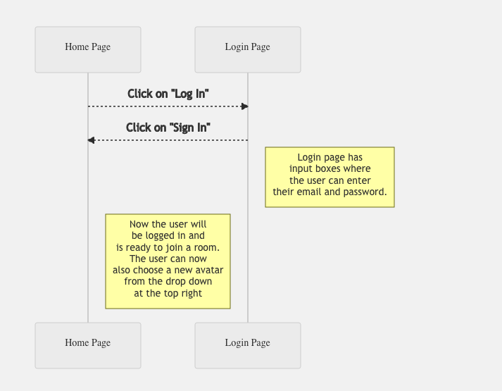
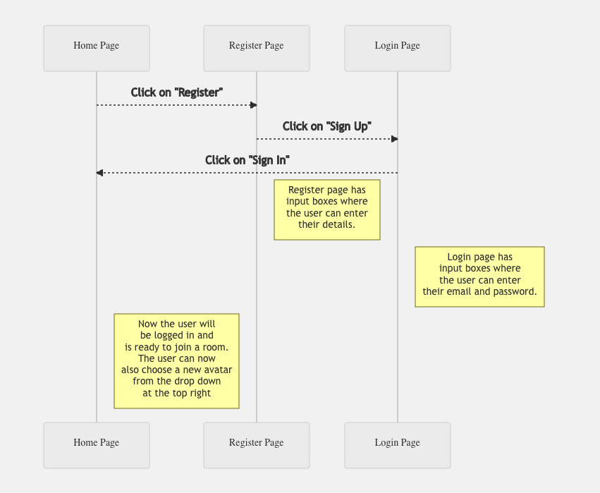
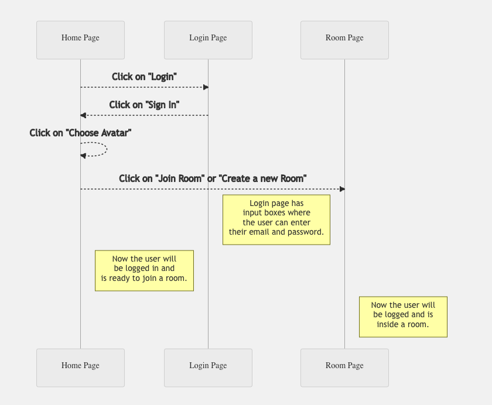
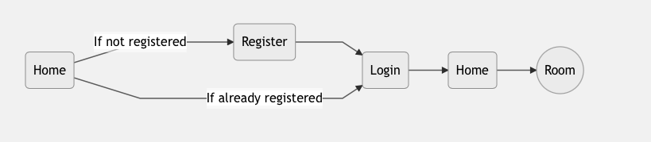

# Covey.Town Design

In this release, we have added real-time persistence to the existing Covey.Town App using Postgres + GraphQL as the backend database stack. Given below is the new high level architecture of the covey.town, which highlights the new features that have been added and how these components interact with each other.

The interactions between these features have been explained below using various sequence diagrams.

## UML diagrams

### 1. Registering as a new User

The diagram below shows the detailed steps in sequential order as to how a new user would use and navigate through are new feature for signing-in to our platform and registering himself.

### 2. Logging-in as an existing User

The diagram below shows the detailed steps in sequential order as to how an existing user who has already registered would use and navigate through are new feature for logging-in to our platform using his credentials and exploring other features such as creating or joining a room or selecting a new avatar.

### Choosing an Avatar as a logged-in User

The diagram below shows the detailed steps in sequential order as to how an existing user who has already registered would use and navigate through are new feature for choosing a new avatar and using it for all subsequent logins.

Finally, this flowchart shows overall, how the whole authentication process will look like:

## Changes made in the codebase:

The following changes have been made in the `components` directory from the original covey.town codebase:

1. **Log-In** Related: `SignInForm.tsx [Route: /signin]` inside the `pages` directory.

2. **Sign-Up** (Registration) Related: `SignUpForm.tsx [Route: /signup]` inside the `pages` directory.

3. The state of whether a particular users is signed in has been maintained inside the `useAppState` so that it is accessible on all the pages.

4. Added new interfaces: `UserLoginRequest`, `UserRegistrationRequest`, `SetAvatarRequest`, `UserLoginResponse`, `GetAvatarRequest`, `GetAvatarResponse`, `UserRegistrationResponse` and new service methods in `TownServiceClient.ts`

5. Added new files: `AvatarModal.tsx` and `ChangeAvatarMenu.tsx` and `navbar.tsx` in the `navbar` directory.
6. **Avatar** Related:
