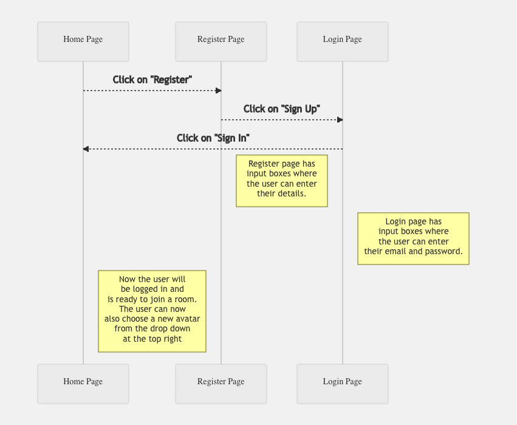
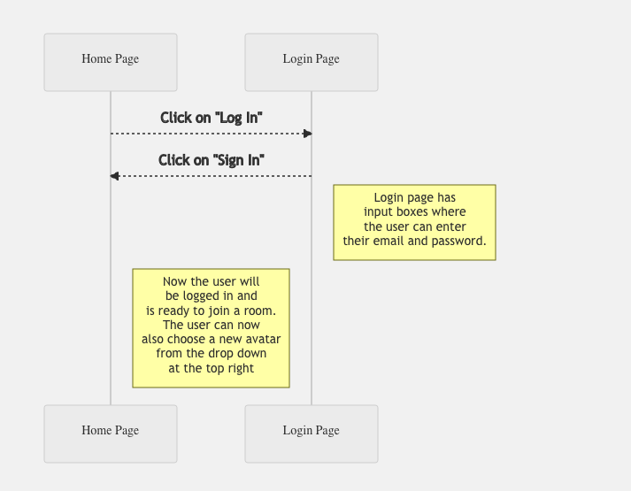

# Covey.Town Design

In this release, we have added real-time persistence to the existing Covey.Town App using Postgres + GraphQL as the backend database stack. Given below is the new high level architecture of the covey.town, which highlights the new features that have been added and how these components interact with each other.

The interactions between these features have been explained below using various sequence diagrams.

## UML diagrams

### 1. Registering as a new User

The diagram below shows the detailed steps in sequential order as to how a new user would use and navigate through are new feature for signing-in to our platform and registering himself.

### 2. Logging-in as an existing User

The diagram below shows the detailed steps in sequential order as to how an existing user who has already registered would use and navigate through are new feature for logging-in to our platform using his credentials and exploring other features such as creating or joining a room or selecting a new avatar.

### Choosing an Avatar as a logged-in User

The diagram below shows the detailed steps in sequential order as to how an existing user who has already registered would use and navigate through are new feature for choosing a new avatar and using it for all subsequent logins.

Finally, this flowchart shows overall, how the whole authentication process will look like:

## Changes made in the codebase:

The following changes have been made in the `components` directory from the original covey.town codebase:

1. `App.tsx` was modified to add Routes. The app routes to different pages when the user performs Sign In and Sign Up opeations.

2. **Log-In** Related: `SignInForm.tsx [Route: /signin]` inside the `pages` directory.This component is rendered as soon as the user clicks
   the button 'Sign In' or when the user registers.

3. **Sign-Up** (Registration) Related: `SignUpForm.tsx [Route: /signup]` inside the `pages` directory. This component is rendered when the user clicks 'Sign Up'
   button. This component has form fields and buttons to complete User registeration.

4. The state of whether a particular users is signed in has been maintained inside the `useAppState` so that it is accessible on all the pages.

5. Added new interfaces: `UserLoginRequest`, `UserRegistrationRequest`, `SetAvatarRequest`, `UserLoginResponse`, `GetAvatarRequest`, `GetAvatarResponse`,  
   `UserRegistrationResponse` and new service methods in `TownServiceClient.ts`

6. Added new files: `AvatarModal.tsx` and `ChangeAvatarMenu.tsx` and `navbar.tsx` in the `navbar` directory.

7. **Change Avatar**: WorldMap.tsx was alterd to read the state 'Avatar' from the global state useAppState. Existing sprite character(Misa) was hardcoded in WorldMap.tsx. This was changed to dynamically read the character from the state and player the existing animations like Walk left, Walk right etc. The Phaser atlas was also loaded with new sprite_new.json and sprite_new.png which has the information of all the new Sprite characters. Also to accomodate this change the Player object was changed to add a new field Avatar. This change is reflected in Player.ts both in service (frontend\src\classes\Player.ts) and client (services\roomService\src\types\Player.ts).

## Steps that should be taken to exercise all the new added features:

1.  On the home screen, click on the `Register` button. Upon clicking on the `Register` button, you’ll be redirected to the Sign Up page. This page will have input boxes for entering the `Name, Email and Password`.
2.  Upon entering the credentials, click on the `Sign Up` button to create a new profile. After that, we’ll be redirected to the Sign In page, where we need to enter the newly created Email and the Password. Then we click on the `Sign In` button.
3.  Then you need to click on the Sign In button upon which you will be redirected to the Home page, where you can choose a new Avatar by clicking the `Choose Avatar` button on the top right corner.
4.  The `Choose Avatar` button hosts multiple avatars with their pictures and the user can click on any of the avatar to use it. The newly selected avatar will then be reflected in the top right corner of the screen as an image.

Note: After every successful or unsuccessful action of the user, we have provided a toast which will notify the user of what just happened.
