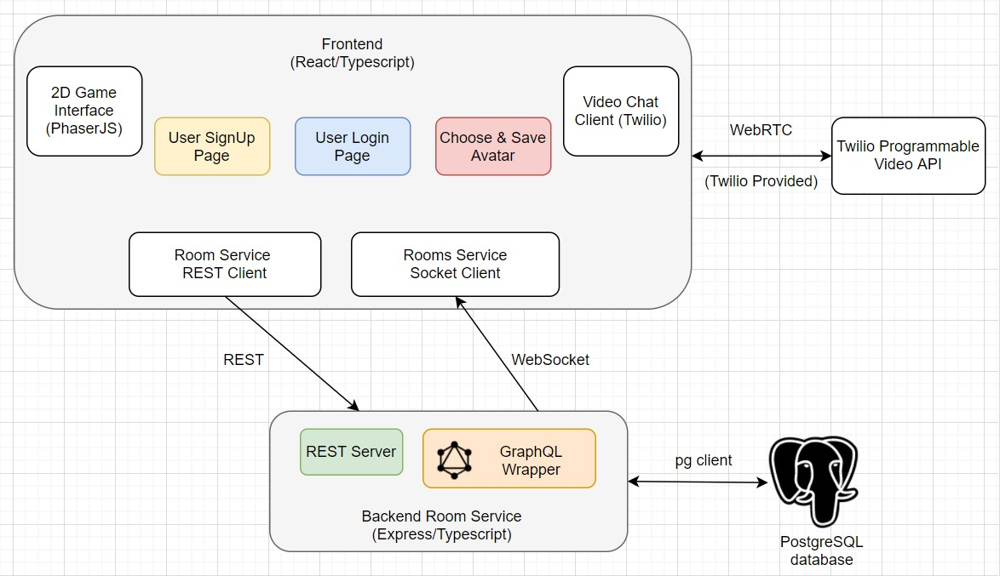

# Covey.Town Design

The following is the high level architechture, of the covey.town, which highlights the new features that have been added.

The interactions between these features have been explained below using various sequence diagrams.

## UML diagrams

### 1. Registering as a new User

### 2. Logging-in as an existing User

### Choosing an Avatar as a logged-in User

Overall, this is how the whole authentication process will look like:

## Changes made in the codebase:

The following changes have been made in the `components` directory:

1. **Log-In** Related: `SignInForm.tsx [Route: /signin]` inside the `pages` directory.

2. **Sign-Up** (Registration) Related: `SignUpForm.tsx [Route: /signup]` inside the `pages` directory.

3. The state of whether a particular users is signed in has been maintained inside the `useAppState` so that it is accessible on all the pages.

4. Added new interfaces: `UserLoginRequest`, `UserRegistrationRequest`, `SetAvatarRequest`, `UserLoginResponse`, `GetAvatarRequest`, `GetAvatarResponse`, `UserRegistrationResponse` and new service methods in `TownServiceClient.ts`

5. Added new files: `AvatarModal.tsx` and `ChangeAvatarMenu.tsx` and `navbar.tsx` in the `navbar` directory.
6. **Avatar** Related:
