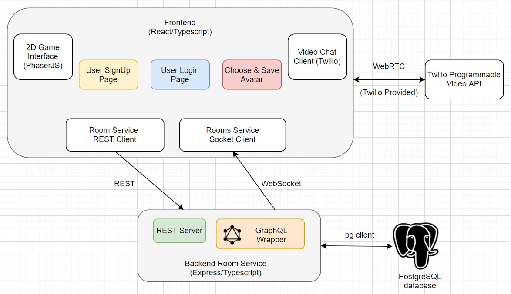

# Covey.Town

Covey.Town provides a virtual meeting space where different groups of people can have simultaneous video calls, allowing participants to drift between different conversations, just like in real life.

Covey.Town was built for Northeastern's [Spring 2021 software engineering course](https://neu-se.github.io/CS4530-CS5500-Spring-2021/), and is designed to be reused across semesters.

You can view our reference deployment of the app at [app.covey.town](https://lucid-meitner-8f93df.netlify.app/).

The figure above depicts the high-level architecture of Covey.Town.

The frontend client (in the `frontend` directory of this repository) uses the [PhaserJS Game Library](https://phaser.io) to create a 2D game interface, using tilemaps and sprites.

The frontend implements video chat using the [Twilio Programmable Video](https://www.twilio.com/docs/video) API, and that aspect of the interface relies heavily on [Twilio's React Starter App](https://github.com/twilio/twilio-video-app-react).

A backend service (in the `services/roomService` directory) implements the application logic: tracking which "towns" are available to be joined, and the state of each of those towns.

## Running this app locally

Running the application locally entails running both the backend service and a frontend.

### Setting up the backend : Twilio

To run the backend, you will need a Twilio account. Twilio provides new accounts with $15 of credit, which is more than enough to get started.

To create an account and configure your local environment:

1. Go to [Twilio](https://www.twilio.com/) and create an account. You do not need to provide a credit card to create a trial account.

2. Create an API key and secret (select "API Keys" on the left under "Settings")

3. Create a `.env` file in the `services/roomService` directory, setting the values as follows:

| Config Value | Description |

| ----------------------- | ----------------------------------------- |

| `TWILIO_ACCOUNT_SID` | Visible on your twilio account dashboard. |

| `TWILIO_API_KEY_SID` | The SID of the new API key you created. |

| `TWILIO_API_KEY_SECRET` | The secret for the API key you created. |

| `TWILIO_API_AUTH_TOKEN` | Visible on your twilio account dashboard. |

### Setting up the backend : PostGres

Next, we need to create and setup the User Database that will store all details about new users that would log in. Since we are using Postgres as our Database Client, following the steps shown below to download and setup Postgres on your system.

1. Install Postgres from https://www.postgresql.org/download/

2. Follow the instructions of the installer to install it in your folder.
3. You will be prompted to create a new Password for accessing Postgres on your system, please save this password somewhere as you need this in the next step.
4. Now open covey.town codebase in a terminal and navigate to `services/roomService/src/schemas/postgres/db.ts` file, and add your password that you saved in the    
   above step next to password field in the json.
6. After installation, add psql to your system path and verify it by typing `psql` in a new terminal.
7. Once inside the Postgres terminal, create a new Database using the following command ` CREATE DATABASE user_details;`
8. Connect to this database that we created using `\c user_details`

8. Now we need to create a new table to store the user details of new users as well as existing users. Enter the following command

       `CREATE TABLE userdata( id SERIAL PRIMARY KEY, email TEXT, name VARCHAR(50), password TEXT, avatar VARCHAR(50) );`

8. Verify a usertable has been created by firing the following query `SELECT * FROM userdata;` and you should see an empty table with columns being created.
9. Now you're finally good to go with Database being setup and connected with our covey.town app. Any new user logging in will be entered into this database.

### Setting up the backend : GraphQL

There is no real set required for running GraphQL, just installing the required libraries. To do this, run `npm install` in the `services/roomService` directory and all required dependencies will be downloaded including GraphQL.

### Starting the backend

Once your backend is configured, you can start it by running `npm start` in the `services/roomService` directory (the first time you run it, you will also need to run `npm install`).

The backend will automatically restart if you change any of the files in the `services/roomService/src` directory.

### Configuring the frontend

Create a `.env` file in the `frontend` directory, with the line: `REACT_APP_TOWNS_SERVICE_URL=http://localhost:8081` (if you deploy the rooms/towns service to another location, put that location here instead)

### Running the frontend

In the `frontend` directory, run `npm start` (again, you'll need to run `npm install` the very first time). After several moments (or minutes, depending on the speed of your machine), a browser will open with the frontend running locally.

The frontend will automatically re-compile and reload in your browser if you change any files in the `frontend/src` directory.
